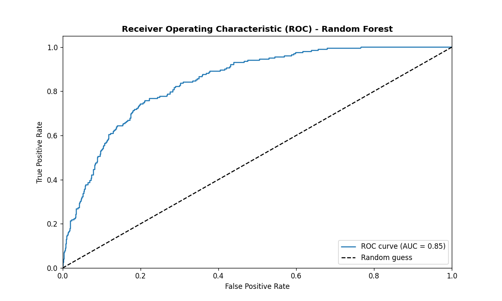
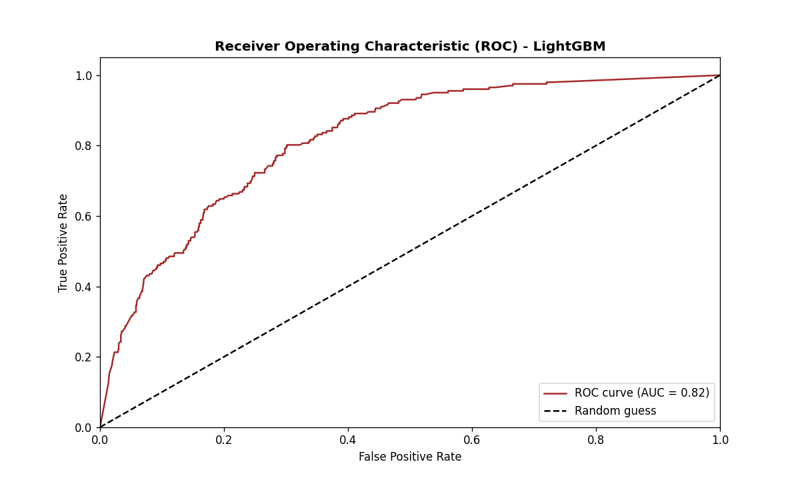
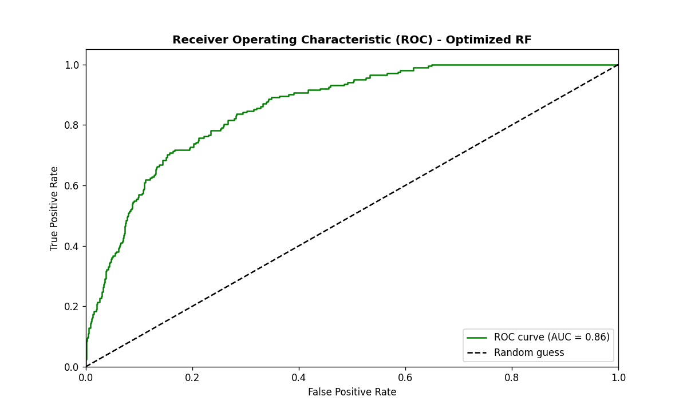
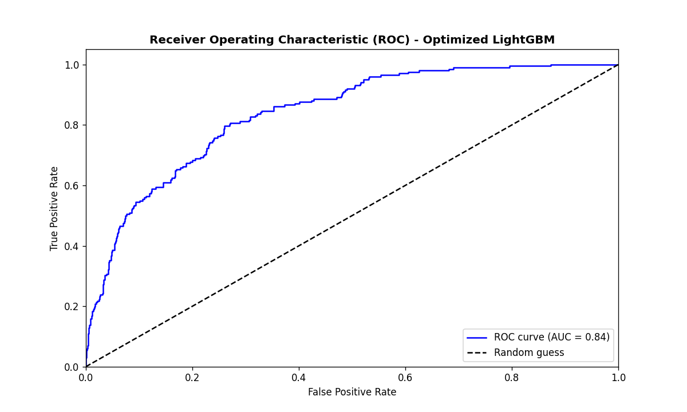

# WINE QUALITY PREDICTION - ADVANCED MACHINE LEARNING TECHNIQUES

## PROJECT OVERVIEW

This project demonstrates the application of advanced machine learning techniques to predict wine quality using physicochemical properties. The project implements multiple ML approaches including  **Ensemble Learning**, **Deep Learning**, **Hyperparameter Optimization**, and **Custom Meta-Learning** to fulfill the requirements of Module 1 deliverables.

## DATASET

* **Source:** The dataset is the <a href="https://archive.ics.uci.edu/dataset/186/wine+quality">UCI Wine Quality Dataset</a> from UCI Machine Learning Repository.
* **Features**: 11 physicochemical properties (acidity, sugar, pH, alcohol, etc.)
* **Target**: Wine quality scores (3-9 scale). It was changed to binary classification (Good/Bad wine).
* **Samples**: ~6,500 wine samples (red and white wines combined)

## ADVANCED ML TECHNIQUES IMPLEMENTED

### Ensemble Learning with Base Model Architecture
Notebook: <a href='./notebooks/03_base_models.ipynb'>03_base_models.ipynb</a>

Two base models (`RandomForest` and `LightGBM`) were trained as complementary learners with different strengths. The models were evaluated with ROC-AUC analysis with detailed curve plotting.

These are the ROC-AUC evaluation results for the base models:

**RandomForest ROC-AUC**

**LightGBM ROC-AUC**

This serves as the foundation for the advanced custom ensemble architecture.

### Hyperparameter Optimization
Notebook: <a href='./notebooks/04_hyperparameter_optimization.ipynb'>04_hyperparameter_optimization.ipynb</a>

Hyperparameter space exploration with cross-validation using `RandomizedSearchCV` from the sci-kit learn library. The best models were subjected to ROC-AUC analysis to compare with base models. The hyperparameters were saved to be used for the custom ensemble models.

The ROC-AUC evaluation results for the optimized base models:

**Optimized RandomForest ROC-AUC**

**Optimized LightGBM ROC-AUC**

