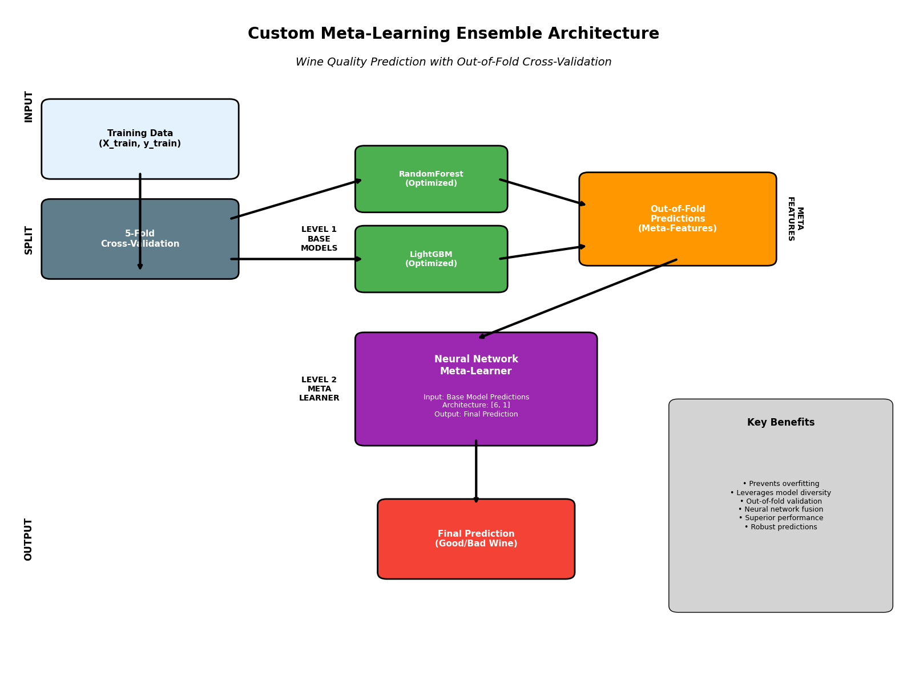
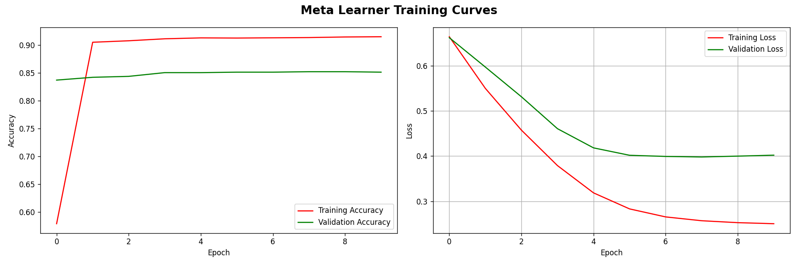
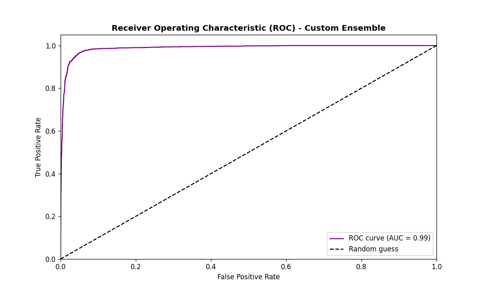

# TASK 1
# WINE QUALITY PREDICTION - ADVANCED MACHINE LEARNING TECHNIQUES

## PROJECT OVERVIEW

This project demonstrates the application of advanced machine learning techniques to predict wine quality using physicochemical properties. The project implements multiple ML approaches including **Ensemble Learning**, **Deep Learning**, **Hyperparameter Optimization**, and **Custom Meta-Learning** to fulfill the requirements of Module 1 deliverables.

## DATASET

- **Source:** The dataset is the [UCI Wine Quality Dataset](https://archive.ics.uci.edu/dataset/186/wine+quality) from UCI Machine Learning Repository.
- **Features**: 11 physicochemical properties (acidity, sugar, pH, alcohol, etc.)
- **Target**: Wine quality scores (3-9 scale). It was changed to binary classification (Good/Bad wine).
- **Samples**: ~6,500 wine samples (red and white wines combined)

## ADVANCED ML TECHNIQUES IMPLEMENTED

### 1. Ensemble Learning with Base Model Architecture

Notebook: [03_base_models.ipynb](notebooks/03_base_models.ipynb)

Two base models (`RandomForest` and `LightGBM`) were trained as complementary learners with different strengths. The models were evaluated with ROC-AUC analysis with detailed curve plotting.

These are the ROC-AUC evaluation results for the base models:

**RandomForest ROC-AUC**

**LightGBM ROC-AUC**

This serves as the foundation for the advanced custom ensemble architecture.

### 2. Hyperparameter Optimization

Notebook: [04_hyperparameter_optimization.ipynb](notebooks/04_hyperparameter_optimization.ipynb)

Hyperparameter space exploration with cross-validation using `RandomizedSearchCV` from the sci-kit learn library. The best models were subjected to ROC-AUC analysis to compare with base models. The hyperparameters were saved to be used for the custom ensemble models.

The ROC-AUC evaluation results for the optimized base models:

**Optimized RandomForest ROC-AUC**

**Optimized LightGBM ROC-AUC**

There were improvements in the AUC metric with the optimized parameters for both models. The RandomForest model's AUC improved from `0.85` to `0.86`, and the LightGBM model from `0.82` to `0.84`.

### 3 & 4. Custom Meta-Learning Ensemble with Deep Learning

Notebook: [05_ensemble_learning.ipynb](./notebooks/05_ensemble_learning.ipynb)

The base models (RandomForest + LightGBM) were used as feature generators for a neural network meta-learner. Out-of-fold predictions were created with cross-validation based meta-features to prevent overfitting and ensure generalization, and then sent to the meta-learner.

The meta-learner is a simple deep learning model trained on the base model's predictions. The model was trained for 10 epochs and validated on `0.15%` of the training data.

This serves as the final stage in the custom ensemble to complete the robust feature extraction and classification. The custom ensemble outperformed the base models and had an AUC of `0.99`, showing a significant improvement from the individual base models.

## OTHER TECHNIQUES IMPLEMENTED

### Data Engineering and Problem Reformulation
Notebook: [01_data_exploration.ipynb](./notebooks/01_data_exploration.ipynb) & [02_data_preprocessing.ipynb](./notebooks/02_data_preprocessing.ipynb)

- Combined red and white wine datasets to form a single dataset and engineered `wine_type` feature after evaluating the feature distribution of both wine types.
- Transformed a regression problem (quality scores ranging from 3-9) to a binary classification (good vs bad wine) problem for easier interpretability. Good wines were filtered by `quality >= 7`.
- Handled class imbalance by oversampling the underrepresented class (good wine).

This project showcases a few advanced machine learning techniques like **Ensemble Learning**, **Deep Learning**, **Hyperparameter optimization**, and a custom ensemble learning pipline with meta learning, in compliance with the `Module 1` deliverable for the advanced Generative AI and Data Science path of the FlexiSAF Internship Program.

Full experiments are in the `notebooks/` folder, and other visualizations can be found in the notebooks or in the `img/` folder.
