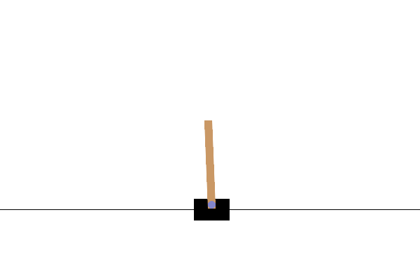

# TASK 2
# Image Captioning with Attention - Advanced Deep Learning

[🎥 Watch demo video](./image-captioning/img/img-captioning-demo.mp4)

## 📋 Project Overview

This project implements an **Image Captioning model** using PyTorch that automatically generates descriptive captions for images. The model uses an **Encoder-Decoder architecture**:

- **Encoder**: Pre-trained ResNet50 CNN extracts visual features from images
- **Decoder**: LSTM network generates captions word-by-word based on image features

This demonstrates advanced deep learning techniques including transfer learning, sequence generation, and encoder-decoder architectures.

---

## 🏗️ Architecture

```
Image → ResNet50 (Encoder) → Feature Vector → LSTM (Decoder) → Generated Caption
```

### Key Components:

1. **EncoderCNN**: Uses ResNet50 to extract 2048-dim features, projects to embedding space
2. **DecoderRNN**: LSTM that generates captions token-by-token
3. **Vocabulary**: Converts between words and numerical indices
4. **Teacher Forcing**: During training, uses ground-truth words as input

## 🎓 Training the Model


### What Happens During Training:

1. **Data Loading**: Images are resized to 224x224, normalized
2. **Forward Pass**: 
   - Images → ResNet → Features
   - Features + Caption words → LSTM → Predictions
3. **Loss Calculation**: Cross-entropy between predicted and actual words
4. **Backpropagation**: Model learns to predict next word
5. **Checkpoints**: Model saved every 5 epochs

---

## 📊 Understanding the Code

### How Caption Generation Works:

1. **Extract Features**: Image → ResNet → Feature vector
2. **Initialize**: Start with `<start>` token
3. **Loop**:
   - Feed current word embedding + features to LSTM
   - LSTM predicts next word
   - Use predicted word as input for next step
4. **Stop**: When `<end>` token is generated or max length reached

### Key Hyperparameters:

- `EMBED_SIZE = 256`: Word embedding dimension
- `HIDDEN_SIZE = 512`: LSTM hidden state size
- `LEARNING_RATE = 3e-4`: Adam optimizer learning rate
- `BATCH_SIZE = 32`: Number of images per batch
- `NUM_EPOCHS = 10`: Full passes through dataset

### Vocabulary:

Special tokens:
- `<pad>`: Padding for variable-length sequences
- `<start>`: Marks beginning of caption
- `<end>`: Marks end of caption
- `<unk>`: Unknown words (below frequency threshold)

---

## 📚 Key Techniques Demonstrated

✅ **Transfer Learning**: Using pre-trained ResNet50  
✅ **Encoder-Decoder Architecture**: CNN encoder + RNN decoder  
✅ **Sequence Generation**: Word-by-word caption generation  
✅ **Embedding Layers**: Converting words to dense vectors  
✅ **Teacher Forcing**: Training technique for RNNs  
✅ **Batch Processing**: Handling variable-length sequences  

---

# Deep Q-Network (DQN) - Reinforcement Learning

[🎥 Watch demo video](./dqn-reinforcement-learning/img/dqn-demo.mp4)



## 📋 Project Overview

This project implements a **Deep Q-Network (DQN)**hh agent that learns to play games through trial and error using reinforcement learning. The agent doesn't receive explicit instructions - instead, it learns optimal behavior by receiving rewards for good actions and penalties for bad ones.

### Key Concept: Q-Learning

**Q-Learning** learns a function Q(s,a) that predicts the expected future reward for taking action 'a' in state 's'. The agent then selects actions that maximize this Q-value.

**DQN Innovation**: Uses a neural network to approximate Q-values, enabling learning in complex environments with large state spaces.

---

## 🎮 What Does It Do?

The agent learns to:
- **CartPole-v1**: Balance a pole on a moving cart.

The agent starts with random behavior and gradually learns optimal strategies through experience!

---

## 🏗️ DQN Architecture

### Three Key Components:

1. **Q-Network (Policy Network)**
   - Neural network that estimates Q(s,a)
   - Learns from experiences to improve predictions

2. **Target Network**
   - Separate copy of Q-network
   - Provides stable learning targets
   - Updated periodically from policy network

3. **Experience Replay Buffer**
   - Stores past experiences (s, a, r, s', done)
   - Breaks correlation between consecutive experiences
   - Enables efficient learning from past data

### Training Process:

```
1. Agent observes state 's'
2. Select action 'a' using ε-greedy (explore vs exploit)
3. Execute action, observe reward 'r' and next state 's''
4. Store experience in replay buffer
5. Sample random batch from buffer
6. Update Q-network to minimize: Q(s,a) - [r + γ max Q(s',a')]
7. Periodically copy policy network → target network
```

---

### Understanding the Output:

E.g:
```
Episode 100/500 | Reward: 187.00 | Avg Reward (100 eps): 145.32 | Epsilon: 0.367 | Loss: 0.0234
```

- **Reward**: Total reward for this episode (higher is better)
- **Avg Reward**: Moving average over last 100 episodes
- **Epsilon**: Exploration rate (decreases over time)
- **Loss**: Q-network prediction error (should decrease)


## 📊 Understanding the Results

### Training Curves

**Reward Curve**: Should show upward trend
- Random performance → Steady improvement → Plateau at optimal
- Moving average smooths out noise

**Loss Curve**: Should decrease
- High at start (bad predictions) → Low at end (accurate Q-values)
- Some fluctuation is normal

### Random vs Trained Comparison

Shows the dramatic improvement:
- Random ~50 → Trained ~500 (about 10x improvement!)

### Q-Value Visualization

Shows agent's confidence:
- Different lines = different actions
- Higher Q-value = better expected reward
- Convergence = agent has learned stable policy

---

## 📚 Key Concepts Demonstrated

✅ **Reinforcement Learning**: Learning from rewards  
✅ **Q-Learning**: Value-based RL algorithm  
✅ **Deep Learning**: Neural networks for function approximation  
✅ **Experience Replay**: Breaking temporal correlations  
✅ **Target Networks**: Stabilizing learning  
✅ **Epsilon-Greedy**: Exploration-exploitation tradeoff  
✅ **Policy Optimization**: Improving action selection over time  

---
